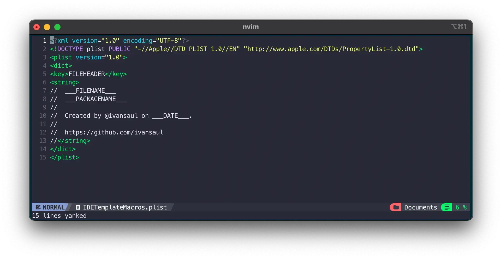
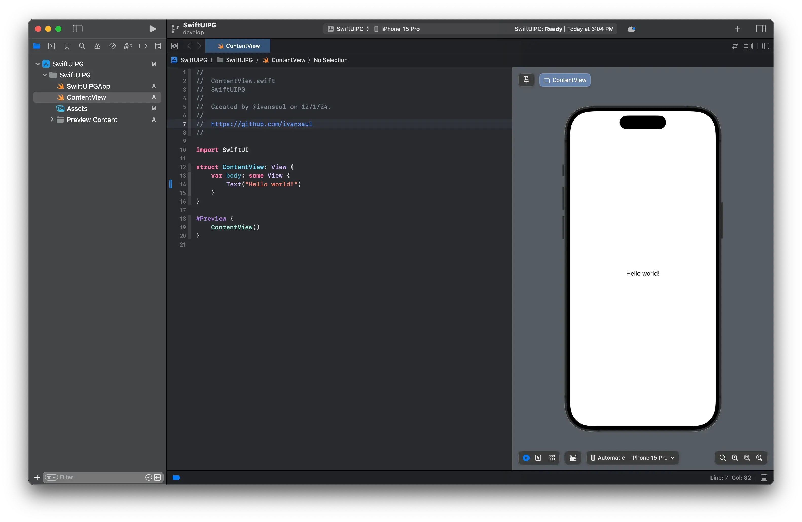

# Xcode How to Customize File Headers

When we create a new file in Xcode, it automatically adds a comment at the top of the file with some information about the file, such as the file name, author, and creation date and so on. Sometimes we need to add some custom information like the version of the project, links to the repository or any other information that we want to keep in the file. In this guide we will learn step by step how to customize the headers using a custom `.plist` file.

## Create a `.plist` file

First, we need to create an empty file named `IDETemplateMacros.plist` with any text editor, in this case we will use `neovim`.

```console
nvim IDETemplateMacros.plist
```

Next, add the following content to the file.

```xml title="IDETemplateMacros.plist"
<?xml version="1.0" encoding="UTF-8"?>
<!DOCTYPE plist PUBLIC "-//Apple//DTD PLIST 1.0//EN" "http://www.apple.com/DTDs/PropertyList-1.0.dtd">
<plist version="1.0">
<dict>
<key>FILEHEADER</key>
<string>
//  ___FILENAME___
//  ___PACKAGENAME___
//
//  Created by @ivansaul on ___DATE___.
//
//  https://github.com/ivansaul
//</string>
</dict>
</plist>
```

After adding the content, you should see something like this:



!!! note
    `FILEHEADER`, `PACKAGENAME`, and `DATE` are text macros that will be replaced with the actual values when the file is created. We can find the list of all available text macros here: [Text macros reference](https://help.apple.com/xcode/mac/current/#/dev7fe737ce0).

## Add the `.plist` file to Xcode

Now we need to put the `.plist` file in the right place, where Xcode will be able to find it. Xcode will look for the `.plist` file in the following locations:

### Globally for Xcode

```console
~/Library/Developer/Xcode/UserData/
```

### Project (single user)

```console
<project-name>.xcodeproj/xcuserdata/<username>.xcuserdatad/
```

### Project (all users)

```console
<project-name>.xcodeproj/xcshareddata/
```

### Workspace (single user)

```console
<workspace-name>.xcworkspace/xcuserdata/<username>.xcuserdatad/
```

### Workspace (all users)

```console
<workspace-name>.xcworkspace/xcshareddata/
```

!!! example "Example"
    If you really want to use in all your projects, you could copy the `.plist` file to the following location:
    ```console
    cp IDETemplateMacros.plist ~/Library/Developer/Xcode/UserData/IDETemplateMacros.plist
    ```

### Use multiple `.plist` files

We can use multiple `IDETemplateMacros.plist` files simultaneously, for example, we can have a global one in the following location:

```console
~/Library/Developer/Xcode/UserData/IDETemplateMacros.plist
```

And a project specific one in the following location:

```console
<project-name>.xcodeproj/xcuserdata/<username>.xcuserdatad/IDETemplateMacros.plist
```

!!! note
    The project specific one will override the global one.

That's it, now we can create new files in Xcode and the headers will be customized, like this:


