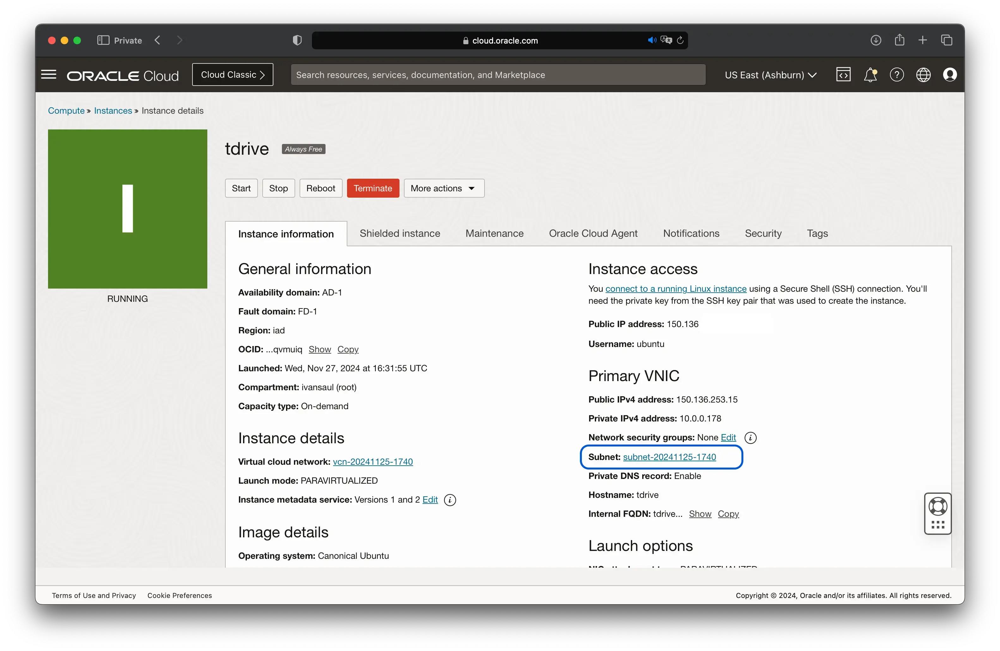
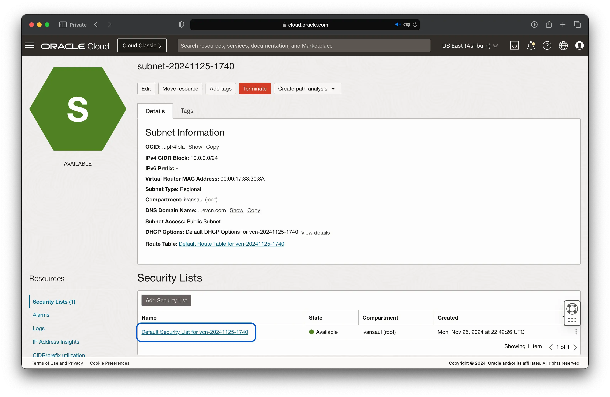
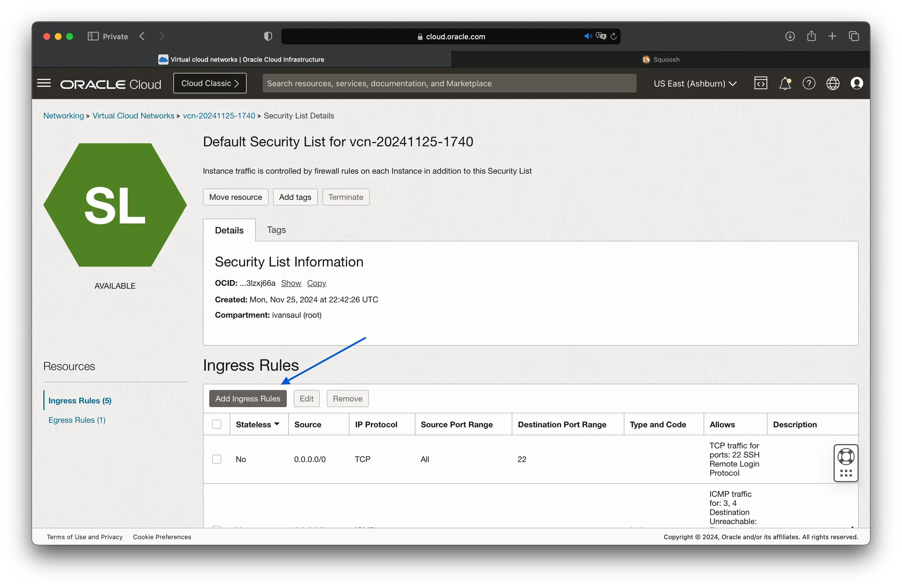
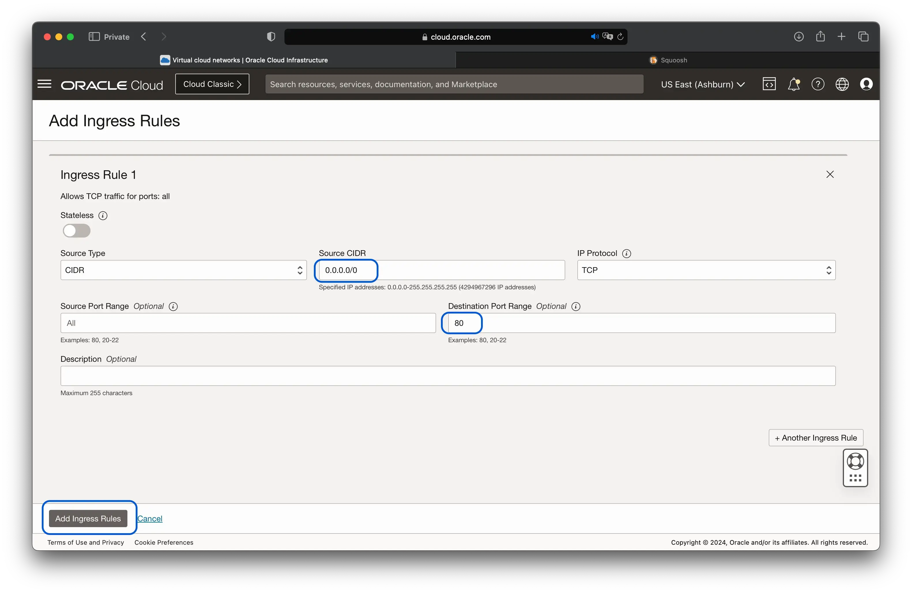

# Opening Ports on Oracle Cloud Instances

Oracle Cloud Infrastructure (OCI) provides a range of services that allow you to build, run, and manage applications in the cloud. One of the key services is the Oracle Cloud Instance, a virtual machine you can use to run your applications.

In this tutorial, we will learn how to open ports on an Oracle Cloud Instance. This is particularly useful when you want to allow incoming traffic on specific ports, such as port 80 for HTTP traffic.

## Adding Ingress Rules

Follow these steps to add ingress rules to your Oracle Cloud Instance:

- Log in to the Oracle Cloud Console.
- Navigate to the Compute menu and select **Instances**.
- Select the instance where you want to open a port.
- Click on the **Subnet** link.



- Go to the **Security Lists** option.



- Click on the **Ingress Rules** tab.



- Add a new rule.



## Modifying iptables

Next, SSH into the instance and modify the iptables to allow incoming traffic on the desired port.

!!! info
    The following steps assume your instance is running on a Ubuntu Linux distribution.

1. SSH into the instance using the `ssh` command:

    ```bash
    ssh -i <path-to-private-key> <username>@<instance-ip>
    ```

2. Modify the iptables rules file using a text editor like `nano` or `vim`:

    ```bash
    sudo nano /etc/iptables/rules.v4
    ```

3. Add the following line to allow traffic on the desired port (e.g., port 80):

    ```bash
    -A INPUT -p tcp -m state --state NEW -m tcp --dport 80 -j ACCEPT
    ```

4. Save the changes and exit the editor.

5. Apply the updated iptables rules:

    ```bash
    sudo iptables-restore < /etc/iptables/rules.v4
    ```

That's it! Your instance should now accept incoming traffic on the specified port. You can test it by accessing the instance using the URL:

```console
http://<instance-ip>:80
```
