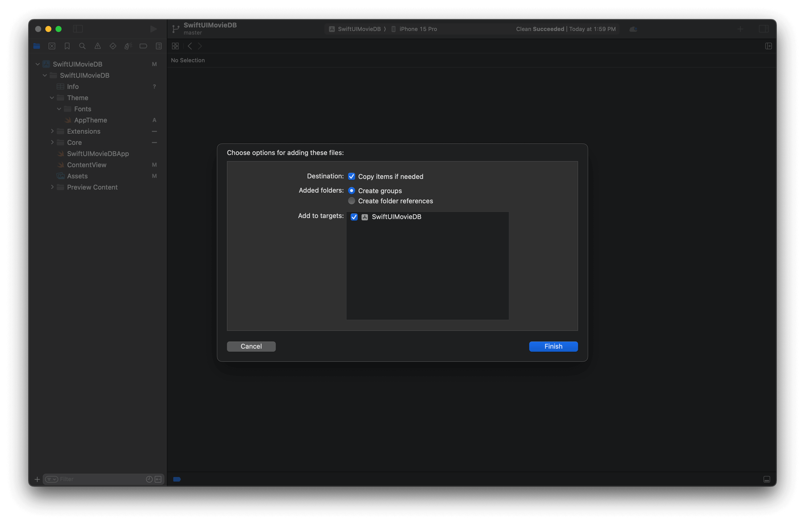
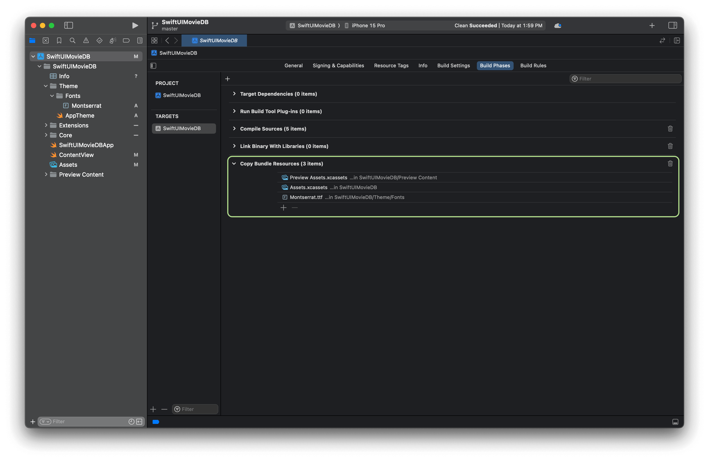
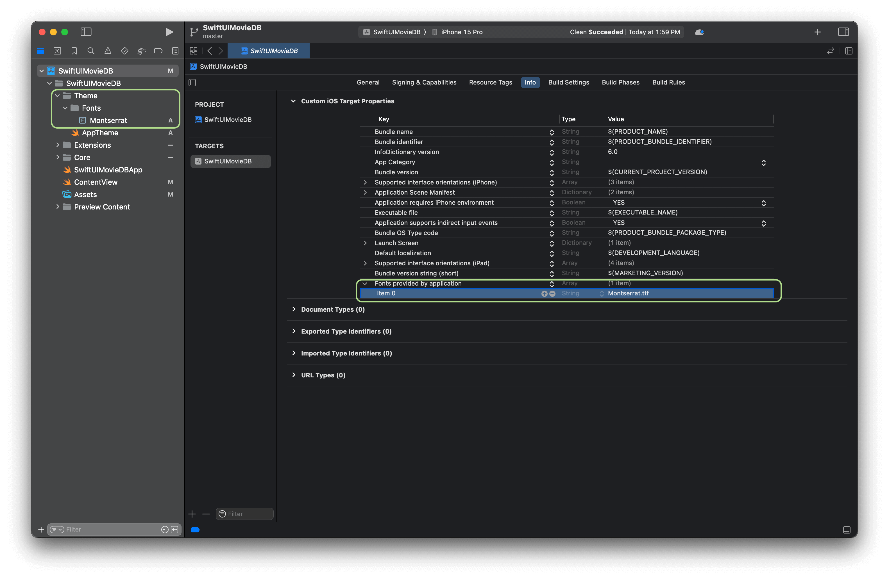
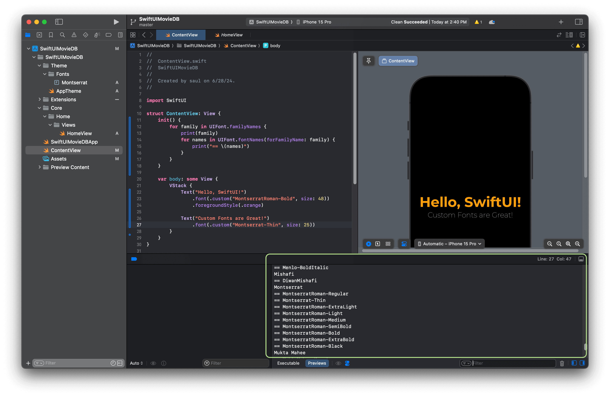

# How to Add Custom Fonts in SwiftUI

Integrating custom fonts into your SwiftUI app can significantly enhance its visual appeal and user experience. This guide will walk you through the steps to add custom fonts to your SwiftUI application.

## Setting Up Your Project

To begin, you need the font files you wish to use. These files are typically in `.ttf` (TrueType Font) or `.otf` (OpenType Font) formats. You can find a variety of fonts on sites like [Google Fonts](https://fonts.google.com/), which offers an extensive collection of open-source fonts.


### Adding Font Files to Your Project

1. Choose and download the font you want to use. Ensure the font is in either `.ttf` or `.otf` format.
2. Drag the downloaded font files into your Xcode project. It’s good practice to create a new group (e.g., `Fonts`) to keep your files organized.
3. When you drag the files into Xcode, ensure that "Copy items if needed" is checked and that the files are added to your app’s target.



### Verifying Font Files in Xcode

To ensure your fonts are correctly added, follow these steps:

1. Go to your project’s settings.
2. Navigate to the `Build Phases` tab.
3. Under `Copy Bundle Resources`, confirm that your font files are listed.



### Updating the `Info.plist` File

To make the fonts available to your app, you need to update the `Info.plist` file:

1. Go to your project’s settings.
2. Navigate to the `Info` tab.
3. Add a new key: `Fonts provided by application`.
4. Add each font file, ensuring you include the correct file name and extension.



## Using Custom Fonts in SwiftUI

With your fonts added and configured, you can now use them in your SwiftUI views. The basic way to display text in SwiftUI is with the `Text` view. To use a custom font, use the `.font` modifier with the `.custom` method.

```swift
import SwiftUI

struct ContentView: View {
    var body: some View {
        VStack {
            Text("Hello, SwiftUI!")
                .font(.custom("MontserratRoman-Bold", size: 48))
                .foregroundStyle(.orange)

            Text("Custom Fonts are Great!")
                .font(.custom("Montserrat-Thin", size: 25))
        }
    }
}

#Preview {
    ContentView()
}
```

Replace `"Montserrat"`  with the exact names of your font files (excluding the file extension).

## Handling Font Failures

It's important to provide a fallback font in case your custom font fails to load. You can do this by using the `.font` modifier conditionally:

```swift
Text("Hello, SwiftUI!")
    .font(Font.custom("MyCustomFont-Regular", size: 24) ?? .system(size: 24))
```

## Finding the Correct Font Name

Sometimes, determining the exact name of a font can be tricky. You can list all available fonts in your app to find the correct font name. Add the following code in your app’s initialization:

```swift
init() {
    for family in UIFont.familyNames {
        print(family)
        for names in UIFont.fontNames(forFamilyName: family) {
            print("== \(names)")
        }
    }
}
```

Running this code will print a list of all font families and their respective font names, helping you identify the correct name to use.


