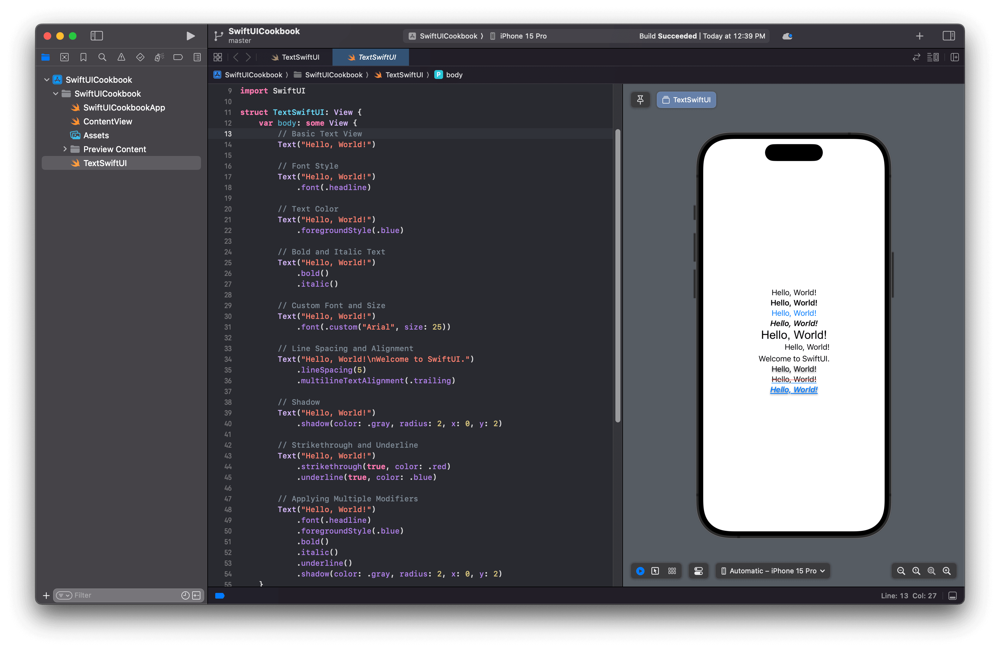

# Add a Text View


[**Source Code**](../../../src/SwiftUICookbook/SwiftUICookbook/TextSwiftUI.swift) 


`Text` views are one of the most fundamental and frequently used components in any SwiftUI user interface. They enable you to display text in your app, serving as labels, titles, descriptions, and much more. SwiftUI's `Text` views are simple to use, require minimal code, and offer a wide range of customization options.

## Creating a Basic Text View

To create a `Text` view, you use the `Text` initializer and provide the text you want to display. Here's an example:

```swift
import SwiftUI

struct TextSwiftUI: View {
    var body: some View {
        Text("Hello, World!")
    }
}
```

In the above code, the `TextSwiftUI` struct conforms to the `View` protocol. Within the `body` property, we return a `Text` view that displays "Hello, World!".

## Customizing Text Views with Modifiers

One of the powerful features of SwiftUI is the ability to customize views using modifiers. Let's explore some of the common modifiers you can use with `Text` views.

### Font Style

You can change the font style of your text using the `.font()` modifier. Here's how to set the text to a headline style:

```swift
struct TextSwiftUI: View {
    var body: some View {
        Text("Hello, World!")
            .font(.headline)
    }
}
```

### Text Color

To change the color of the text, use the `.foregroundColor()` modifier:

```swift
struct TextSwiftUI: View {
    var body: some View {
        Text("Hello, World!")
            .foregroundStyle(.blue)
    }
}
```

### Bold and Italic Text

To make the text bold or italic, use the `.bold()` and `.italic()` modifiers:

```swift
struct TextSwiftUI: View {
    var body: some View {
        Text("Hello, World!")
            .bold()
            .italic()
    }
}
```

### Custom Font and Size

If you want to use a custom font and size, you can do so with the `.font()` modifier combined with `.custom()`:

```swift
struct TextSwiftUI: View {
    var body: some View {
        Text("Hello, World!")
            .font(.custom("Arial", size: 25))
    }
}
```

### Line Spacing and Alignment

Adjusting the line spacing and text alignment can enhance readability:

```swift
struct TextSwiftUI: View {
    var body: some View {
        Text("Hello, World!\nWelcome to SwiftUI.")
            .lineSpacing(5)
            .multilineTextAlignment(.trailing)
    }
}
```

## Advanced Customizations

### Shadow

Adding a shadow to your text can create a more dramatic effect:

```swift
struct TextSwiftUI: View {
    var body: some View {
        Text("Hello, World!")
            .shadow(color: .gray, radius: 2, x: 0, y: 2)
    }
}
```

### Strikethrough and Underline

You can apply strikethrough or underline to your text:

```swift
struct TextSwiftUI: View {
    var body: some View {
        Text("Hello, World!")
            .strikethrough(true, color: .red)
            .underline(true, color: .blue)
    }
}
```

## Applying Multiple Modifiers

Modifiers can be chained to apply multiple customizations:

```swift
struct TextSwiftUI: View {
    var body: some View {
        Text("Hello, World!")
            .font(.headline)
            .foregroundStyle(.blue)
            .bold()
            .italic()
            .underline()
            .shadow(color: .gray, radius: 2, x: 0, y: 2)
    }
}
```

## Screenshots

<figure><figcaption><p>Add a Text View in SwiftUI</p></figcaption></figure>
