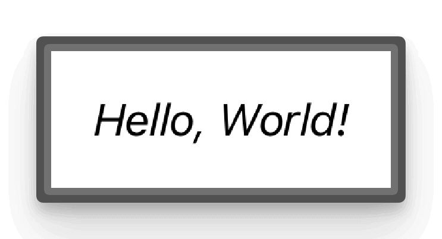
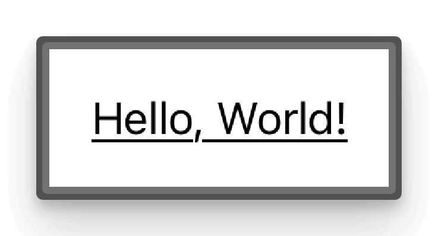

# SwiftUI Text

`Text` views are one of the most fundamental and frequently used components in any SwiftUI user interface. They enable us to display text in our apps, serving as labels, titles, descriptions, and much more. SwiftUI's `Text` views are simple to use, require minimal code, and offer a wide range of customization options.

??? example "Source code"
    ```swift title="TextView.swift"
    --8<-- "docs/assets/code/swiftui/SwiftUIPG/SwiftUIPG/GettingStarted/TextView.swift"
    ```

## Basic Text View

The simplest way to create a `Text` view is by using the `Text` initializer with a string literal. This creates a view that displays the specified text.

```swift
import SwiftUI

struct TextView: View {
    var body: some View {
        Text("Hello, World!")
    }
}

#Preview {
    TextView()
}
```

In this example, the `TextView` struct conforms to the `View` protocol and defines a `body` property that returns a `Text` view with the text "Hello, World!". The `#Preview` directive is used to preview the view in the Xcode preview area.

<figure markdown="span">
{ width=300 }
</figure>

## Text Styles

One of the powerful features of SwiftUI is the ability to customize views using modifiers. Let's explore some of the common modifiers that can be used with `Text` views.

### Font Style

We can use the `font` modifier to change the font of a `Text` view. Here's how to set the text to a headline style:

```swift
import SwiftUI

struct TextView: View {
    var body: some View {
        Text("Hello, World!")
            .font(.headline) // (1)!
    }
}
```

1. If we want to use a custom font, we need to use the `font` modifier combined with the `custom` modifier, `.font(.custom("Arial", size: 20))` will set the font to Arial with a size of 20.

<figure markdown="span">
{ width=300 }
</figure>

### Font Weight

We can use the `fontWeight` modifier to change the font weight of a `Text` view. Here's how to set the text to a `light` weight:

```swift
import SwiftUI

struct TextView: View {
    var body: some View {
        Text("Hello, World!")
            .fontWeight(.light)
    }
}
```

<figure markdown="span">
{ width=300 }
</figure>

### Text Color

To change the color of a `Text` view, we can use the `foregroundColor` modifier.

```swift
import SwiftUI

struct TextView: View {
    var body: some View {
        Text("Hello, World!")
            .foregroundColor(.orange)
    }
}
```

<figure markdown="span">
{ width=300 }
</figure>

### Text Italic

We can use the `italic` modifier to make the text italic.

```swift
import SwiftUI

struct TextView: View {
    var body: some View {
        Text("Hello, World!")
            .italic()
    }
}
```

<figure markdown="span">
{ width=300 }
</figure>

### Text Underline

We can use the `underline` modifier to underline the text.

```swift
import SwiftUI

struct TextView: View {
    var body: some View {
        Text("Hello, World!")
            .underline()
    }
}
```

<figure markdown="span">
{ width=300 }
</figure>

### Text Shadow

We can use the `shadow` modifier to add a shadow to the text.

```swift
import SwiftUI

struct TextView: View {
    var body: some View {
        Text("Hello, World!")
             .shadow(color: .gray, radius: 2, x: 0, y: 2)
    }
}
```

<figure markdown="span">
{ width=300 }
</figure>

## Applying Multiple modifiers

We can apply multiple modifiers to a `Text` view by chaining them together.

```swift
import SwiftUI

struct TextView: View {
    var body: some View {
        Text("Hello, World!")
            .font(.headline)
            .foregroundColor(.orange)
            .italic()
            .underline()
            .shadow(color: .gray, radius: 2, x: 0, y: 2)
            .strikethrough(true, color: .red)
    }
}
```

<figure markdown="span">
{ width=300 }
</figure>

As you can see, the `Text` view now has a headline style, orange color, italic text, and a shadow effect.

Another useful modifier are the `multilineTextAlignment`, `lineLimit`, and lineSpacing` modifiers. Let's see how they work.

```swift
import SwiftUI

struct TextView: View {
    var body: some View {
        Text("Hello, World!\nWelcome to SwiftUI\nThe future of app development")
            .lineSpacing(5)
            .lineLimit(2)
            .multilineTextAlignment(.trailing)
    }
}
```

In the example above, the `Text` view is a multiline text. The `lineLimit` modifier is used to limit the number of lines, in this case, to 2.

<figure markdown="span">
{ width=300 }
</figure>

That's it! We've covered the basics of `Text` views in SwiftUI. In the next posts, we'll explore how to use `Text` views to create more complex user interfaces.
